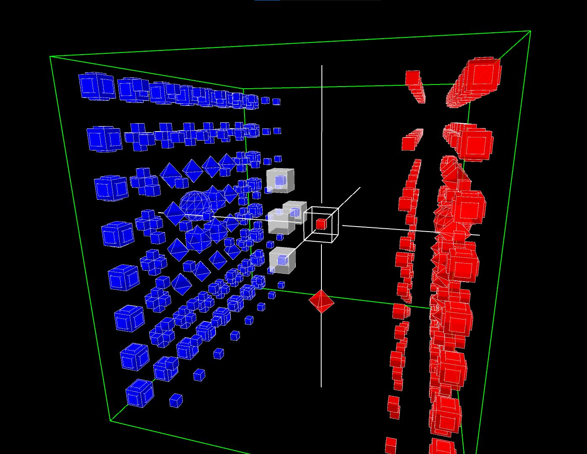

# Chess-3D

In this project, I implemented my 3D generalization of chess.
It is played on an 8x8x8 board, each player has 128 pieces (the arrangement of them is similar to the original chess).
The Processing code includes navigation in 3D (rotation and scaling) and basic interactions.
When you select a piece, the program automatically shows you where you can go with it.
Detecting which moves are legal and which are not is also included in the more that 3000 lines of java code.

